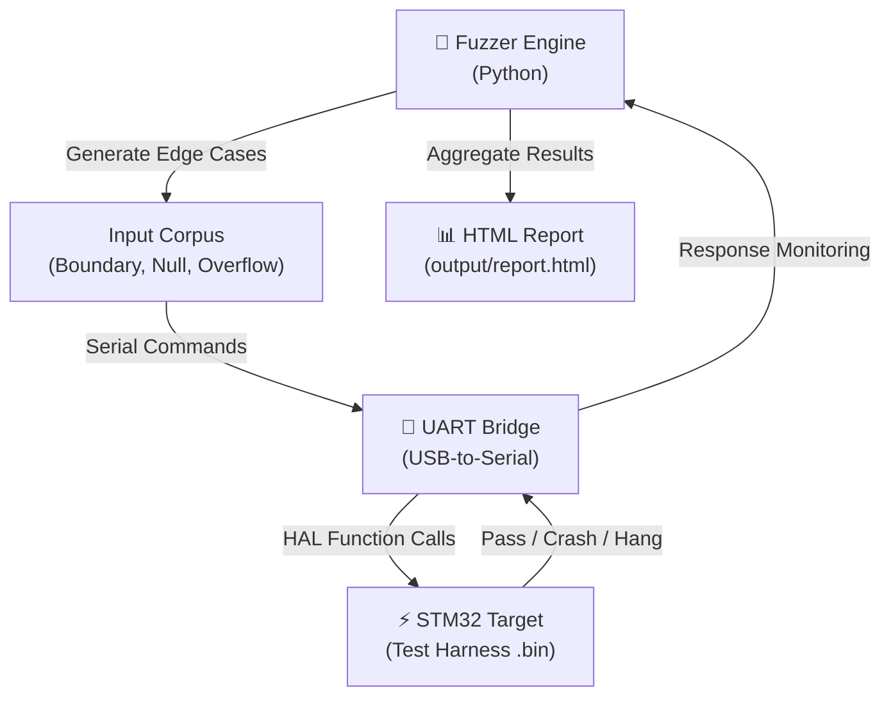

<div align="center">

# 🔨 STM32 HAL Fuzzer
**Automated Edge-Case & Stress Tester for STM32 HAL Functions**


[](https://github.com/EngineerAbdullahBinZafar/stm32-hal-fuzzer/actions)
[](https://opensource.org/licenses/MIT)
[](https://st.com)
[](https://python.org)

*Your HAL code works with normal inputs. Does it survive the edge cases?*

[Why Fuzz STM32?](#-why-fuzz-your-stm32-hal) • [Features](#-features) • [Quick Start](#%EF%B8%8F-quick-start) • [Architecture](#-architecture) • [Output Report](#-sample-output-report)

</div>

---

## 🤔 Why Fuzz Your STM32 HAL?

Firmware crashes are not random — they are edge cases you didn't test:

- `HAL_GPIO_WritePin` called with an invalid GPIO port → **Hard Fault**
- `HAL_UART_Transmit` called with `Size = 0` → **Undefined behaviour**
- `HAL_TIM_PWM_Start` on a non-initialized timer → **Silent failure**

Manual testing will never cover all combinations of invalid inputs. **The `stm32-hal-fuzzer` generates thousands of these edge-case inputs automatically**, runs them on a connected STM32, monitors for crashes and hangs, and generates a beautiful diagnostic report.

---

## ✨ Features

| Feature | Description |
|:---|:---|
| 🎲 **Automated Edge-Case Generation** | Generates boundary, null-pointer, and overflow inputs for any HAL function |
| 📡 **Live UART Monitoring** | Monitors the STM32's debug UART for crash signatures and hard fault handlers |
| ⏱️ **Timeout Detection** | Detects function hangs (no response within configurable timeout) |
| 📊 **HTML Diagnostic Report** | Generates a colour-coded pass/fail report for every test case |
| 🔌 **Zero Firmware Modification** | Works via a thin test harness flashed once — no need to touch your HAL code |

---

## ⚡️ Quick Start

```bash
# 1. Clone the fuzzer
git clone https://github.com/EngineerAbdullahBinZafar/stm32-hal-fuzzer.git
cd stm32-hal-fuzzer
pip install -r requirements.txt

# 2. Flash the test harness firmware to your STM32
#    (Pre-built .bin for STM32F407 in /firmware/)

# 3. Run the fuzzer against a target HAL module
python -m stm32_fuzzer.fuzz \
    --port /dev/ttyACM0 \
    --baud 115200 \
    --target HAL_UART \
    --iterations 500

# 4. Open the generated report
open output/report.html
```

---

## 📐 Architecture



---

## 📋 Sample Output Report

```
==========================================
 STM32 HAL Fuzzer — Run Report
 Target: HAL_UART_Transmit
 Iterations: 500 | Duration: 42.3s
==========================================
 ✅ PASS   [0001] Size=1,   Data=0x00     (2.1ms)
 ✅ PASS   [0002] Size=255, Data=0xFF     (2.4ms)
 ❌ CRASH  [0047] Size=0,   Data=0x00     → Hard Fault detected!
 ⏱️ HANG   [0203] Size=256, Data=random  → Timeout (5000ms)
 ✅ PASS   [0498] Size=128, Data=random   (2.2ms)
------------------------------------------
 Summary: 497 Pass | 1 Crash | 1 Hang | 1 Error
 Report saved to: output/report_20250506.html
==========================================
```

---

## 🤝 Contributing
See [CONTRIBUTING.md](CONTRIBUTING.md) and [CODE_OF_CONDUCT.md](CODE_OF_CONDUCT.md).

**Open Bounties:**
- Support for STM32 SPI and I2C HAL fuzzing
- Integration with OpenOCD for JTAG-based crash detection
- CI template for automated fuzzing on every firmware commit

## 📄 License
MIT License — See `LICENSE` for details.

## 👤 Author
Built by **Engineer Abdullah Bin Zafar** — [GitHub](https://github.com/EngineerAbdullahBinZafar) · [LinkedIn](https://linkedin.com/in/abdullah-bin-zafar)

*If you caught a crash before it went to production, drop a ⭐!*
